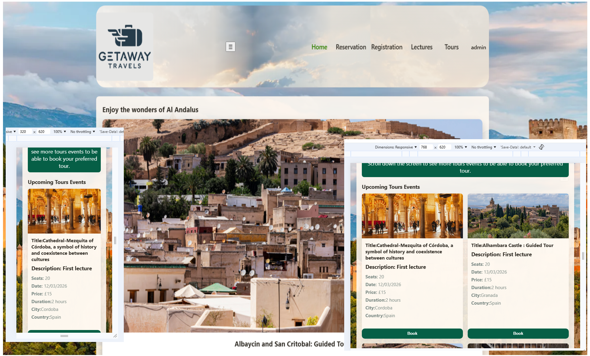
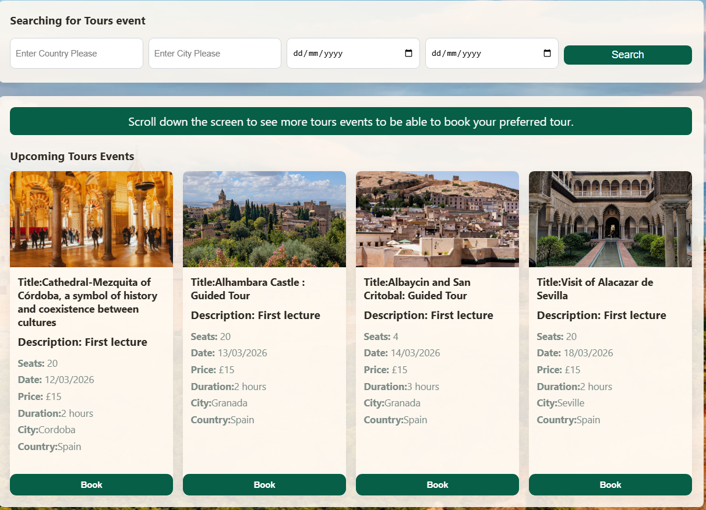
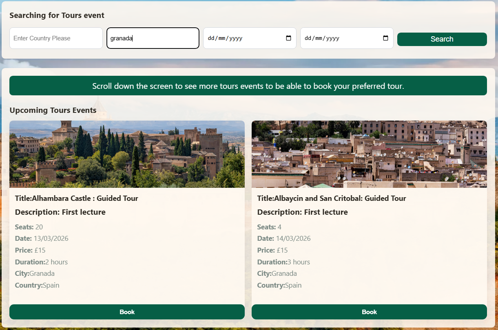
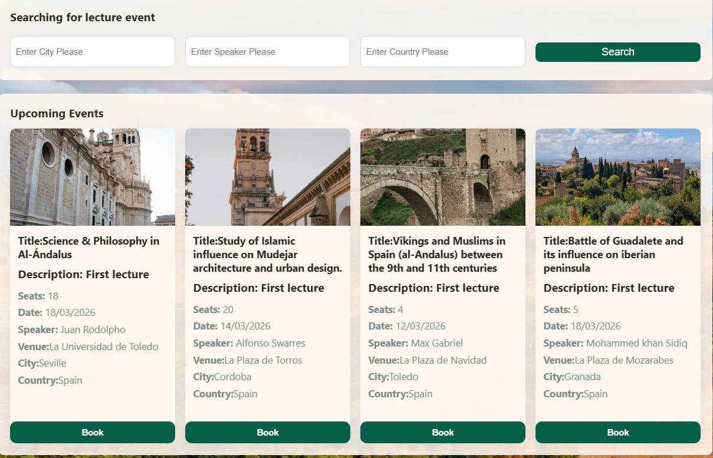
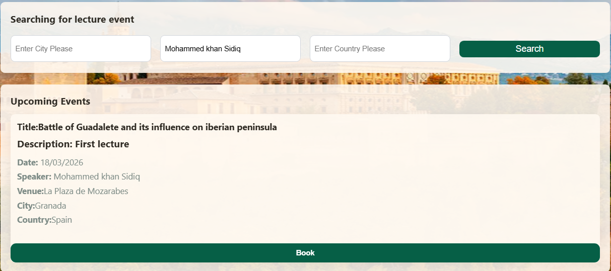
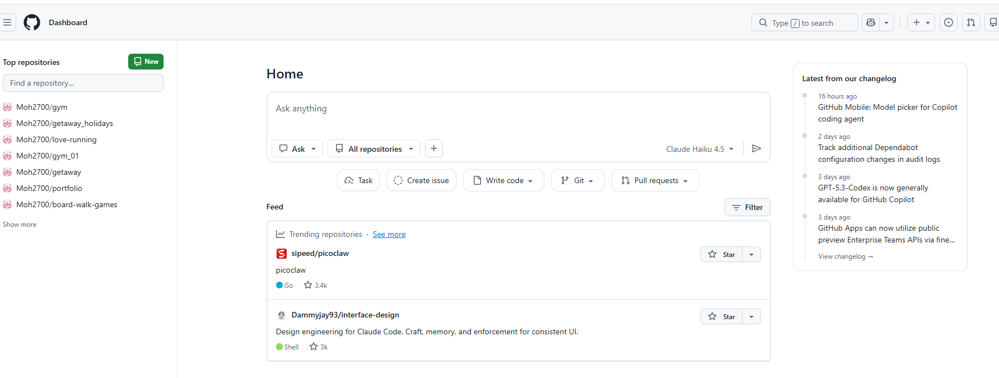
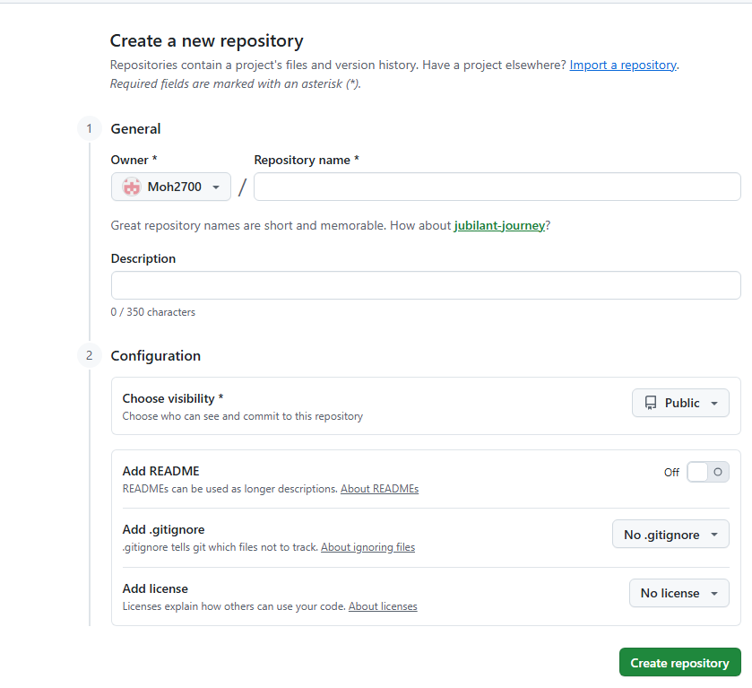

<h1 align="center">Getaway Holidays Website</h1>

[View the live project here.] ("https://moh2700.github.io/getaway_holidays/index.html")

This is the main Internet booking website for Getaway Travels. It is designed to be responsibe and accessible on a range of devices, making it easy to navigate for potential Visitors and researches enthusiast for the lost Jewel of wonderful Moorish Andalusian Convivencia during the reign of Muslims in Spain.

<h2 align="center"></h2>

<h2 align="center"></h2>

# Getaway Holidays overview

This website specializes in booking historical tours and educational lectures focused on Al-Andalus and the Moorish legacy in Iberia. It offers expertly guided experiences that explore the region’s history, culture, architecture, and intellectual heritage.

The platform allows users to easily discover and book tours and talks led by knowledgeable historians and cultural experts, making the history of Andalusia engaging, accessible, and meaningful for a global audience.

Visitors can easily discover, explore, and book guided tours of historic cities, monuments, and archaeological sites, as well as attend in-depth lectures led by historians, researchers, and cultural experts. Each experience is designed to provide historical accuracy, thoughtful storytelling, and meaningful context, connecting past civilizations with the present.

# Getaway Holidays User Story

### As a Visitor / History Enthusiast

1. As a Visitor/ History Enthusiast using the system I want to be able to browse historical tours and lectures about Al-Andalus so I can choose experiences that match my interests.

2. I want to see detailed descriptions, dates, locations, and historical context so I understand what each experience offers.

3. I want to book tours or lectures online easily so I can secure my spot without hassle.

### As a Tourist

1. As a tourist, I want to filter tours by city, country and date so I can plan my trip efficiently.

2. As a tourist, I want to see tour duration and language options so I can choose what fits my schedule.

### As a Student / Researcher

1. As a learner, I want access to lectures and historical resources so I can deepen my understanding of Moorish history.

2. As a learner, I want to attend online or in-person lectures so I can learn regardless of my location.

### As a Tour Guide / Lecturer

1. As a guide, I want to create and manage my tours or lectures so I can present my expertise.

2. As a guide, I want to see bookings and attendee numbers so I can prepare properly.

### As an Admin

1. As an admin, I want to manage tours, lectures, users, and bookings so the platform runs smoothly.

2. As an admin, I want to update content and schedules so information stays accurate and current.

# Getaway Holidays Features

- **Navigation Bar**
  - the full responsive navigation bar includes links to the Logo, Home page, Tours, Registration, Lectures and Login page for easy navigation through the existing system
  - This section will allow the user to easily navigate from section to section across all devices in my program.

- **The Home page image**
  1. This includes an image about the magnificent and still holding at this time the Alahambra Castle wordly known as the jewel of a wonderful era of cohexistence between three cultures Islamic and Judeo Christian during the reign of Muslims in Al Andalus.
  2. This section introduces the user to the history of an eye cathing of the wonders of Andalusian heritage of Muslim Spain.

- **The Login Hyperlink**

1.  When making a selection for this option the user is prompted with a logging screen to enter the credentials to use the system.
2.  This screen is only for admin to view and manage the system. The normal registered user has no access to this option.
3.  This option allow the user to delete [Registered Users], [Booked Tour Users], [Booked Lectures Users] and hopefully update users details if times has got no constraints.

- **The Tours Hyperlink**
  The user can browse the varierty of tours offered.

- **The Lectures Hyperlink**
  

- **The Registration Menu**
  - New Registration Hyperlink

  
  - Show Users Hyperlink

This admin option for showing users list registered on the system is only accessible when you login as admin with the following credentials:

1. username: admin
2. password: admin

- Show Users

- **The Reservation Menu**
  - Reserved Tours Hyperlink

This admin option for showing booked tours users list registered on the system is only accessible when you login as admin with the following credentials:

1. username: admin
2. password: admin

- Reserved Lectures Hyperlink

# Testing

The system has no restrictions when it comes to browsing for lectures and tours in which the user can have multitude information regarding the Al Andalus. But to be able to use the system for booking tours or lectures, the user needs to be registered through the website.
The screens below will highlight how the system works.

- Booking Tours

- Booking Lectures

# Testing Search

- Tours Section

Testing if the search routine is working for city option

Testing result for search routine for city option

- Lectures Section

Testing if the search routine is working for speaker option

Testing result for search routine for city option

# Responsive Design

Here is in this graphic image it shows how the application is responsive to many devices
such as tablet and mobile phones in which the application is adapting itself to every reponsive possible situation.

# Error Validation

- Registration form

Here is in this screen the user must enter the credentials properly otherwise they won't be able to progress in the system. The second screen is checking for valid email address which allow him/her to use and register for the system.

- Login Form

  

Here the Admin needs to enter the right password and username to be able to login to the system to be able to see more functionalities in the system.

username = admin
password = admin

# Project Structure

# HTML page Validator

# Javascript page Validator

# Features not implemented at this stage

1. I want to view the guide and lecturer profiles so I can trust the expertise behind the content.
2. I want to receive booking confirmations and reminders so I don’t miss my experience.

# Deployment

# Step 1: Initialize a Git Repository in a Frontend Project

1. Navigate to your frontend project folder in the terminal and initialize a local Git Repository

git init

2. This command will create a .git folder where the details of the repository like remote and username and email are stored.

# Step 2: Configure Git username and password

Set your identity locally for this specific project.

- git config user.name "Your Name"
- git config user.email "your.email@example.com"

To configure globally for your future repositories:

- git config --global user.name "Your Name"
- git config --global user.email "your.email@example.com"

This step ensures that every commit is linked to your identity.

# Step 3: Create a New Repository on Github

Click the "+" icon on the top-right corner. Select "New repository".

# create repository

Fill in the repository name (e.g., MyProject), add an optional description, choose Public or Private, and click Create repository.

# How to create a Repository on github

New Repository

Note: Once created, GitHub shows you a few lines of code — copy the one with

# Step 4: Now Add, Commit and push your Frontend Code

Back to vscode and in your terminal(inside your project folder) enter the the following comands:

- git add .
- git commit -m " added frontend file"
- git remote add origin https://github.com/your-username/your-repo-name
- git branch -M master
- git push -u origin main
  This will push your HTML, CSS, and JavaScript files to the GitHub repository.

- Now that your project has been initialized with Git and pushed to GitHub, let’s host it on GitHub Pages. GitHub Pages is a free service that allows you to publish web projects directly from a GitHub repository.

# GitHub Pages

GitHub Pages turns your GitHub repository into a website. It's an easy way to showcase your projects without needing a separate hosting service. You can create static websites directly from your repositories.

- Go to your GitHub repository in a web browser.

- Click on the "Settings" tab.

- Scroll down to the "Pages" section in the left-hand menu.

- Under "Source," select the branch you want to publish from (typically main or master), and choose the root folder.

- Selecting the branch and root folder for GitHub Pages.

- Click "Save button"

- How to Get Your GitHub Pages URL
  After enabling GitHub Pages, GitHub will provide you with a URL where your site is published. It usually follows this format:

https://<username>.github.io/<repository-name>

- How to Update Your GitHub Pages Site
  Every time you push changes to the selected branch in your repository, GitHub Pages will automatically update your live site. Here’s a quick reminder on how to push changes:

- Make changes to your project files.

- Add and commit your changes:

Any changes to the website done locally on vscode will be updated to the existing project on GITHUB pages

- git add .
- git commit -m "Your commit message"

# Push the changes to GitHub:

git push origin main

# Bugs

# Project Limitations/Challenges

All the data shown for tours and lectures is being pulled from Json files which are

- tours.json
- lectures.json

In a proper commercial applications the website will be using data directly from a back end database password protected and all the security features on it to protect our data system. But at this precise moment, we are going to be just contented with json files.
Updating json files is a nightmare and it is very difficult to do so because of lack of online security and less protection on the existing data files.
At the moment we are only using volatile memory to do data handling when using the system such as Creating new users, Booking new tours and lectures. They are done locally and saved to memory. But as soon as the user refresh the page everything is lost.

# Media

- **Pexels and Unsplash website**

- The photos were taken from from This Open Source site
  - [Pexels Site] ("https://www.pexels.com/search/andalucia/)"
  - [Unsplash Site] ("https://unsplash.com/s/photos/andalucia")

- The photos used in the home page and the links in json files.

# Running the Project

After all the setup has been done locally and on Github or any other cloud based platform.
In the case of Github Just enter the following link in the browser and the system is up and running. The link in other platform might be different becuse of the nature of the platform being used.

-[Getaway Travels] ("https://moh2700.github.io/getaway_holidays/index.html")

## Credits

### Code

Various online source I used them to build my project.

- [StackOverflow post](https://stackoverflow.com)

- [MDN Web Docs](https://developer.mozilla.org/)

- [W3 Schools](https://www.w3schools.com/)

### Acknowledgements

- Tutor support at Code Institute/East Anglia College for their support.

# Project Challenges / Issues

- [ Main page ] ("https://github.com/Moh2700/getaway_holidays/issues/1")
- [ Menu header ] ("https://github.com/Moh2700/getaway_holidays/issues/2")
- [ Section for Lectures ] ("https://github.com/Moh2700/getaway_holidays/issues/3")
- [ json data structure ] ("https://github.com/Moh2700/getaway_holidays/issues/4")
- [ lecture data event ] ("https://github.com/Moh2700/getaway_holidays/issues/5")
- [ Tours Event ] ("https://github.com/Moh2700/getaway_holidays/issues/6")
- [ Tours Event] ("https://github.com/Moh2700/getaway_holidays/issues/7")
- [ Global data structure] ("https://github.com/Moh2700/getaway_holidays/issues/8")
- [ Saving data to json file] ("https://github.com/Moh2700/getaway_holidays/issues/9")
- [ Search holiday tours] ("https://github.com/Moh2700/getaway_holidays/issues/10")
- [ Booking lecture tours] ("https://github.com/Moh2700/getaway_holidays/issues/11")
- [ Data Structure] ("https://github.com/Moh2700/getaway_holidays/issues/12")
- [ user registration ] ("https://github.com/Moh2700/getaway_holidays/issues/13")
- [ Booking Tours/Lecture event] ("https://github.com/Moh2700/getaway_holidays/issues/14")
- [ Search Lecture] ("https://github.com/Moh2700/getaway_holidays/issues/15")
- [ Search Tours] ("https://github.com/Moh2700/getaway_holidays/issues/16")
- [ Search Lectures] ("https://github.com/Moh2700/getaway_holidays/issues/17")
- [ Booking Tours] ("https://github.com/Moh2700/getaway_holidays/issues/18")
- [ Search Tours] ("https://github.com/Moh2700/getaway_holidays/issues/19")

# Project Technologies Used

1. [HTML5] ("https://html.spec.whatwg.org/multipage/")
2. [CSS] ("https://www.w3.org/Style/CSS/Overview.en.html")
3. [Javascript] ("https://devdocs.io/javascript/")
4. [Javascript] ("https://developer.mozilla.org/en-US/docs/Web/JavaScript")
